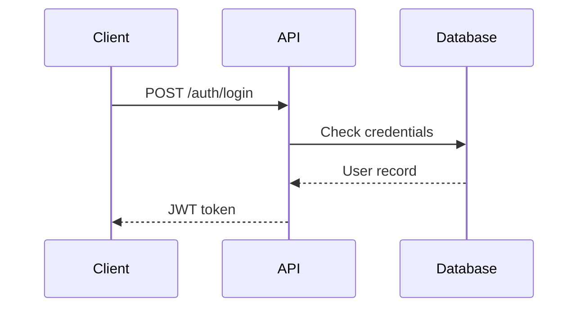

The developer tooling ecosystem in 2026 is better than it's ever been — and a huge portion of the best tools are free or have genuinely useful free tiers. But the sheer volume of options is overwhelming.

This list is curated from actual developer usage, not affiliate revenue. Every tool here is either free forever or has a free tier that's useful without hitting walls immediately. Organized by workflow stage so you can find what you need fast.

---

## Code Editors and IDEs

### VS Code — The Universal Standard

**Platform:** Windows, macOS, Linux
**Free:** Yes, completely

VS Code is the default choice for good reason. With 50,000+ extensions, built-in Git integration, a remote development framework, and a thriving plugin ecosystem, it handles every language and workflow. AI extensions (GitHub Copilot, Continue, Codeium) make it competitive with purpose-built AI editors.

Essential extensions to install immediately:
- `esbenp.prettier-vscode` — auto-formatting
- `dbaeumer.vscode-eslint` — JavaScript linting
- `ms-vscode-remote.remote-ssh` — remote development
- `eamodio.gitlens` — Git superpowers

**Download:** code.visualstudio.com

### Cursor — AI-Native Editor

**Platform:** Windows, macOS, Linux
**Free:** Hobby tier (limited AI calls per month)

Cursor is a VS Code fork rebuilt around AI. Its Composer mode (multi-file editing), Tab completion, and codebase-aware chat are genuinely faster than VS Code + Copilot for AI-heavy workflows. The free tier is limited but usable for side projects.

### Zed — Fast, Minimal, Collaborative

**Platform:** macOS, Linux (Windows in progress)
**Free:** Yes

Zed is built in Rust, starts in under 100ms, and is designed for collaborative editing (Google Docs-style multiplayer built in). If VS Code feels heavy and you're on macOS, Zed is worth trying. It's lightweight but rapidly gaining extension support.

---

## Terminal and Command Line

### iTerm2 (macOS) / Windows Terminal (Windows)

The default terminal emulators. Both are free.

**iTerm2** features: split panes, search, unlimited scrollback, shell integration (shows command exit status in the gutter), tmux integration.

**Windows Terminal** features: tabs, multiple shells in one window (WSL, PowerShell, CMD), GPU-accelerated rendering, custom profiles.

### Oh My Zsh + Starship

**Platform:** macOS, Linux
**Free:** Yes

Transform your terminal experience:

```bash
# Install Zsh (usually pre-installed on macOS)
# Install Oh My Zsh
sh -c "$(curl -fsSL https://raw.githubusercontent.com/ohmyzsh/ohmyzsh/master/tools/install.sh)"

# Install Starship prompt (fast, cross-shell, context-aware)
curl -sS https://starship.rs/install.sh | sh
```

Starship shows Git branch status, active language versions (Node, Python, Go), command duration, and exit codes — all in your prompt, without slowing it down.

### fzf — Fuzzy Finder

**Platform:** All
**Free:** Yes

`fzf` is a command-line fuzzy finder that supercharges your shell:

```bash
# Install
brew install fzf    # macOS
sudo apt install fzf  # Debian/Ubuntu

# Enable shell integration
$(brew --prefix)/opt/fzf/install

# Now Ctrl+R gives you interactive history search
# Ctrl+T gives you fuzzy file picker
# Alt+C gives you fuzzy directory navigator
```

Once you use it, going back is painful.

### ripgrep (rg) — Faster Grep

**Platform:** All
**Free:** Yes

```bash
brew install ripgrep  # macOS
sudo apt install ripgrep  # Linux

# Search for pattern recursively (respects .gitignore)
rg "function authenticate" --type js

# With context lines
rg -C 3 "error handling"
```

ripgrep is 10-100x faster than grep on large codebases. Respects `.gitignore` automatically.

### bat — Better cat

```bash
brew install bat   # macOS

# Syntax highlighting, line numbers, Git integration
bat src/app.py
bat --paging=never package.json
```

`bat` is `cat` with syntax highlighting, line numbers, and git diff markers in the gutter.

---

## API Development and Testing

### Hoppscotch — Open Source Postman Alternative

**Platform:** Web (hoppscotch.io) or self-hosted
**Free:** Yes (self-hosted is fully free)

Hoppscotch is what Postman used to be before the monetization squeeze. It's a full-featured API testing tool — REST, GraphQL, WebSocket, Socket.io — with collections, environments, and team sharing. The web version is free. Self-host with Docker for a fully private setup.

```bash
# Self-host with Docker
docker run -d \
  -p 3170:3170 \
  hoppscotch/hoppscotch
```

### Bruno — API Client That Lives in Your Repo

**Platform:** Windows, macOS, Linux
**Free:** Yes (open source)

Bruno stores API collections as files in your repository — no external account, no cloud sync. Your API tests live alongside your code in Git. This is how it should work.

```bash
brew install --cask bruno  # macOS
```

Collections are stored in a simple plaintext format (Bru language). Commit them, review them in PRs, run them in CI.

### curl + jq

The classic combination for quick API testing without leaving the terminal:

```bash
# Install jq (JSON processor)
brew install jq   # macOS
sudo apt install jq   # Linux

# Make an API call and format the response
curl -s https://api.github.com/users/torvalds | jq '.'

# Filter specific fields
curl -s https://api.github.com/users/torvalds | jq '{name: .name, followers: .followers}'

# POST with JSON body
curl -X POST https://api.example.com/users \
  -H "Content-Type: application/json" \
  -d '{"name": "Alice", "email": "alice@example.com"}' | jq '.'
```

### HTTPie

A friendlier curl for humans:

```bash
brew install httpie
http GET https://api.github.com/users/torvalds
http POST api.example.com/users name=Alice email=alice@example.com
```

---

## Database Tools

### DBeaver — Universal Database GUI

**Platform:** Windows, macOS, Linux
**Free:** Community Edition is fully featured

DBeaver connects to PostgreSQL, MySQL, SQLite, MongoDB, Redis, DynamoDB, and 80+ other databases. SQL editor with autocomplete, ER diagram viewer, data export, and query history. The Community Edition is genuinely complete — no features hidden behind the pro tier for standard usage.

**Download:** dbeaver.io

### TablePlus (Free Tier)

**Platform:** macOS, Windows, Linux
**Free:** Limited (2 tabs, 2 connections)

TablePlus has a cleaner UI than DBeaver. The free tier is limited but works for quick inspections. Worth having alongside DBeaver.

### SQLite Browser

**Platform:** All
**Free:** Yes

For local SQLite databases (Django default, mobile apps, embedded systems), DB Browser for SQLite is the standard. Simple, fast, focused.

---

## Version Control and Git

### GitHub (Free Tier)

GitHub's free tier includes:
- Unlimited public and private repositories
- GitHub Actions (2,000 CI/CD minutes/month)
- GitHub Packages (500MB storage)
- GitHub Pages (static site hosting)
- Dependabot security alerts

For most individual developers and small teams, the free tier is more than sufficient.

### GitKraken (Free for Public Repos)

A visual Git client with an intuitive branching visualization. Free for open-source projects.

### Lazygit — Terminal Git UI

```bash
brew install lazygit  # macOS
sudo add-apt-repository ppa:lazygit-team/release && sudo apt install lazygit  # Ubuntu
```

Lazygit gives you a full-screen terminal UI for Git — stage hunks, rebase interactively, resolve conflicts, all without memorizing complex commands. Once you learn the keybindings, it's faster than any GUI.

---

## AI Coding Assistants (Free Tiers)

### GitHub Copilot (Free Tier)

GitHub added a free tier in late 2024: 2,000 code completions per month and 50 chat requests. Enough for part-time projects.

### Codeium — Truly Free AI Coding

**Platform:** VS Code, JetBrains, Neovim, and more
**Free:** Yes, unlimited for individuals

Codeium offers unlimited code completions and chat for free — no monthly limit. The quality is below Copilot but meaningful, especially for completions. Strong option if you hit Copilot's free tier limits.

### Continue — Open Source AI Coding

**Platform:** VS Code, JetBrains
**Free:** Yes

Continue is an open-source AI coding assistant. You bring your own API key (Anthropic, OpenAI, Ollama for local). No vendor lock-in, you control the model. Excellent for teams with API access.

### Ollama — Run LLMs Locally

```bash
# Install and run
curl -fsSL https://ollama.ai/install.sh | sh
ollama run llama3.2
ollama run codellama
```

Ollama runs open-source models locally. No API costs, fully private. Pair with Continue in VS Code for a free AI coding setup. Requires a decent GPU for best results; CPU-only works but is slow.

---

## Development Environment

### Docker Desktop (Free for Personal Use)

Docker Desktop is free for individual developers and small teams (under $10M revenue, fewer than 250 employees). For larger organizations, Docker has commercial licensing requirements.

Containerize your development databases, services, and entire environments. Essential for any developer.

### Devcontainers (VS Code Feature)

Dev Containers is a VS Code feature that runs your entire development environment inside a Docker container — including VS Code itself, its extensions, and all your tools. Define the environment in `.devcontainer/devcontainer.json`:

```json
{
  "name": "Node.js",
  "image": "mcr.microsoft.com/devcontainers/typescript-node:20",
  "features": {
    "ghcr.io/devcontainers/features/github-cli:1": {}
  },
  "postCreateCommand": "npm install"
}
```

Share this file and every team member gets an identical environment in one click.

### asdf — Version Manager for Everything

```bash
# Install
git clone https://github.com/asdf-vm/asdf.git ~/.asdf --branch v0.14.0

# Add plugins
asdf plugin add nodejs
asdf plugin add python
asdf plugin add golang

# Install specific versions
asdf install nodejs 20.11.0
asdf global nodejs 20.11.0

# Per-directory version via .tool-versions file
echo "nodejs 20.11.0" > .tool-versions
```

asdf replaces `nvm`, `pyenv`, `rbenv`, and `gvm` with a single tool. One manager for all language runtimes.

---

## Monitoring and Observability (Free Tiers)

### Grafana + Prometheus (Self-Hosted)

The industry-standard monitoring stack. Both are open source and free to self-host:

```yaml
# docker-compose.yml
services:
  prometheus:
    image: prom/prometheus
    volumes:
      - ./prometheus.yml:/etc/prometheus/prometheus.yml
    ports:
      - "9090:9090"

  grafana:
    image: grafana/grafana
    ports:
      - "3001:3000"
    environment:
      - GF_SECURITY_ADMIN_PASSWORD=admin
```

Grafana Cloud has a generous free tier for hosted metrics.

### Sentry (Free Tier)

Error tracking with a free tier that handles 5,000 errors/month and 10GB attachments. Integrates with every major language and framework.

### Uptime Robot

Free tier monitors 50 websites every 5 minutes and alerts you when they go down. Email alerts on the free tier are sufficient for personal projects.

---

## Documentation and Knowledge Management

### Markdown + Obsidian

**Obsidian** is a local-first markdown editor with backlinks, graph view, and a plugin ecosystem. Free for personal use. Your notes are plain markdown files — no lock-in.

### Docusaurus (Open Source)

Build documentation sites with Markdown + React. Used by Meta, Supabase, Prisma. Free and open source, deploy to Vercel or Netlify for free.

### Mermaid — Diagrams in Code

Mermaid generates diagrams from text syntax. Supported natively in GitHub, GitLab, and Obsidian:



---

## CI/CD and Automation

### GitHub Actions (2,000 Free Minutes/Month)

GitHub Actions automates build, test, and deploy workflows. The free tier gives 2,000 minutes/month for private repos (unlimited for public). Most projects don't exceed this.

### Netlify / Vercel (Free Hosting Tiers)

Both platforms offer:
- Free static site and serverless function hosting
- Automatic deploys on git push
- Preview deployments for PRs
- HTTPS by default

For frontend projects and APIs, these free tiers handle significant traffic.

### Make (formerly Integromat) — Free Automation Tier

1,000 operations/month free. For automation workflows between APIs (Webhooks, Slack notifications, database updates), Make's visual workflow builder is faster to set up than code.

---

## Browser Tools for Developers

### Chrome DevTools (Built In)

The browser's built-in developer tools. Underutilized by most developers:

- **Performance tab**: Record and analyze runtime performance
- **Coverage tab**: See which JS/CSS is unused on load
- **Network tab**: Throttle to 3G, inspect request waterfall
- **Lighthouse**: Audit performance, accessibility, SEO from the browser

No install needed — `F12` or `Cmd+Option+I`.

### Wappalyzer

Browser extension that identifies technologies used by websites. See what framework, CMS, CDN, analytics, and services any site uses.

---

## Security Tools

### OWASP ZAP — Web App Security Scanner

Free, open-source DAST (Dynamic Application Security Testing). Scan your web application for common vulnerabilities: XSS, SQL injection, CSRF, and more. Available as a desktop app or Docker image.

```bash
docker run -d owasp/zap2docker-stable zap-webswing.sh
```

### Trivy — Container Vulnerability Scanner

```bash
brew install trivy
trivy image nginx:latest
trivy fs .
```

Scans Docker images and filesystems for known CVEs. Free and open source from Aqua Security.

---

## Utility Tools

### devplaybook.cc Online Tools

For quick developer tasks without installing anything:

- **Base64 encoder/decoder** — encode and decode without leaving the browser
- **JSON formatter** — pretty-print and validate JSON
- **Regex tester** — test patterns with real-time explanation
- **Cron expression builder** — generate and explain cron schedules
- **Color format converter** — hex, RGB, HSL conversion
- **Timestamp converter** — Unix timestamps to human-readable dates
- **Hash generator** — MD5, SHA-256, SHA-512
- **Diff checker** — compare two blocks of text

All tools at **[devplaybook.cc](https://devplaybook.cc)** — no signup, no ads, fast.

### tldr — Simplified Man Pages

```bash
npm install -g tldr
tldr git
tldr docker
tldr curl
```

`tldr` gives practical examples for commands instead of the full man page. `man curl` gives 4,000 lines. `tldr curl` gives the 10 commands you actually use.

---

## Building Your Developer Toolkit

Not every tool on this list is right for everyone. Here's a minimal setup recommendation by use case:

**For web developers:** VS Code + GitHub + Docker + Hoppscotch + DBeaver + Vercel

**For backend/API developers:** VS Code + Bruno + DBeaver + Postman CLI + Docker + ripgrep

**For DevOps/platform engineers:** VS Code + Lazygit + Grafana + Trivy + Prometheus + Helm

**For solo makers/indie hackers:** VS Code + Vercel + Supabase (free tier) + Hoppscotch + Ollama (local AI)

The best toolkit is the one you actually use. Start minimal, add tools when a specific pain point justifies them.

---

Bookmark **[devplaybook.cc](https://devplaybook.cc)** for more curated developer tools, guides, and productivity resources — updated continuously.
